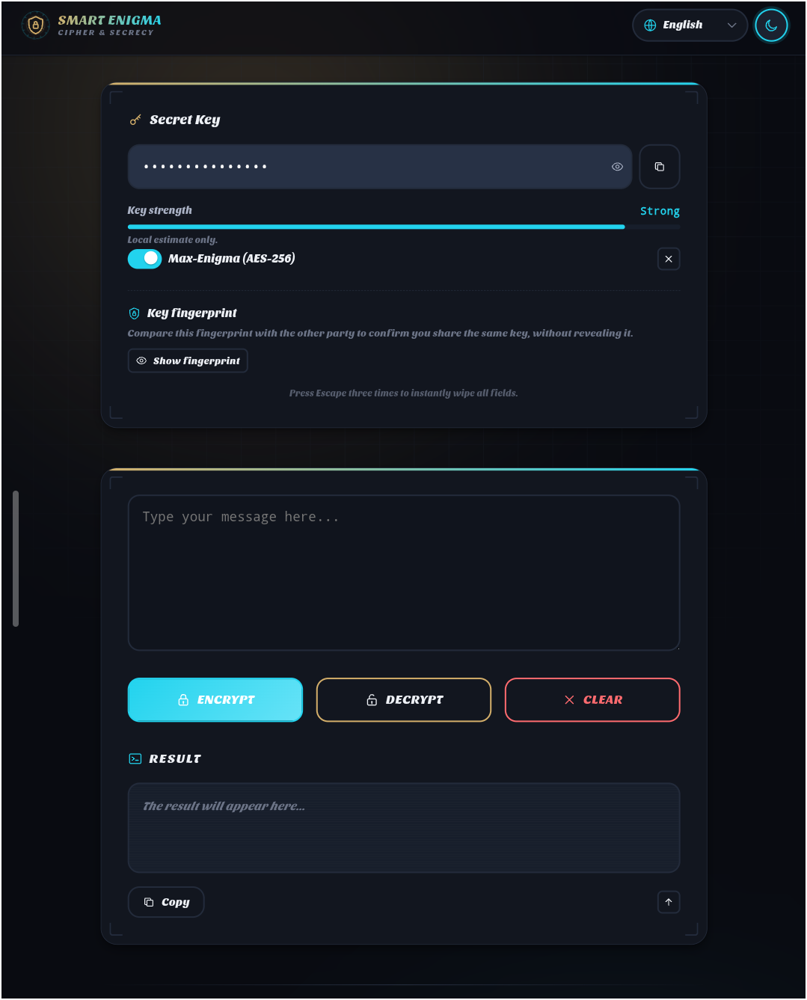

# Smart Enigma

A client-side, offline text encryption tool with real AES-256-GCM — nothing ever leaves your browser.




## Features

- 🔒 **Real AES-256-GCM encryption** via the native Web Crypto API (PBKDF2, 600,000 iterations, random salt + IV per message)
- 🕵️ **Zero network calls** — no analytics, no tracking, no external fonts or CDNs
- 🌍 **9 languages** — English, French, Chinese, Spanish, Russian, German, Portuguese, Italian, Korean (auto-detected from the browser)
- 🌗 **Light / dark theme** with system preference detection
- 🗝️ Key strength indicator and key fingerprint (SHA-256 safety number) to verify a shared key without revealing it
- ⚠️ Panic wipe — press Escape three times to instantly clear the key, message, and result
- 🗝️ Key is never stored or transmitted, and is wiped from memory when the tab closes
- ♿ Accessible: keyboard navigation, `aria-live` regions, `prefers-reduced-motion` and `prefers-contrast` support
- 📴 Fully offline-capable — works from downloaded files, no install, no server
- 🧩 Optional legacy substitution cipher, clearly labeled as a demo (not secure) for educational comparison

## Requirements

- Any modern browser with Web Crypto API support (Chrome, Firefox, Safari, Edge — desktop or mobile)
- No build tools, no dependencies, no server

## Project Structure

```
smart-enigma/
├── index.html
├── style.css
└── README.md
```

## Installation

**Option 1 — Download directly**

```bash
curl -L -o smart-enigma.zip https://github.com/fuegodev369/smart-enigma/archive/refs/heads/main.zip
unzip smart-enigma.zip
```

**Option 2 — Clone the repo**

```bash
git clone https://github.com/fuegodev369/smart-enigma.git
cd smart-enigma
```

Then just open `index.html` in your browser. That's it.

## Usage

Smart Enigma is a single-page app — there is no command line. Everything happens through the interface:

| Control | Description |
|---|---|
| Secret Key | The password used to derive your encryption key (never sent anywhere) |
| Max-Enigma toggle | Keep it **on** for real AES-256-GCM encryption (default and recommended) |
| Message box | The text you want to encrypt or decrypt |
| ENCRYPT | Encrypts the message with the current key |
| DECRYPT | Decrypts a previously encrypted message with the same key |
| CLEAR | Wipes the message and result (asks for confirmation) |
| Copy buttons | Copy the key or the result to your clipboard |
| Key strength meter | Local heuristic estimate of how strong your key looks |
| Key fingerprint | SHA-256 safety number to compare with the other party without revealing the key |
| Panic wipe | Press Escape three times to instantly clear key, message, and result |
| Language selector | Switch between 9 supported languages |
| Theme toggle | Switch between light and dark mode |

## Interactive flow example

```
1. Enter a secret key, e.g.: correct-horse-battery-staple
2. Type your message: Meet me at the usual place, 9pm.
3. Keep "Max-Enigma (AES-256)" enabled.
4. Click ENCRYPT.

RESULT:
kR3n9F2vLxQ8mZaP1sT6wYb4cV7dJhN0gU5eK2iO...  (base64 blob)

5. Send this text to the recipient through any channel you like.
   They open the same page, enter the same key, paste the blob,
   and click DECRYPT to recover the original message.
```

## Output example

The encrypted result is a single base64 string containing the random salt, the random IV, and the ciphertext — everything needed to decrypt except the key itself:

```
xN9m2QeR8pKzV3sLtY7bJ4cD1wA6gU0iO5hF2nE8...
```

## Default behavior

| Situation | Behavior |
|---|---|
| Max-Enigma toggle | ON by default (AES-256-GCM) |
| No key entered | Toast warning, action cancelled |
| No message entered | Toast warning, action cancelled |
| Wrong key on decrypt | "Decryption failed" toast, output cleared |
| Tab closed | Key field wiped from memory |
| Triple Escape press | Key, message, and result wiped instantly, no confirmation |
| Browser language unsupported | Falls back to English |
| System theme | Detected automatically on first load |

## Contributing

Issues and pull requests are welcome on [GitHub](https://github.com/fuegodev369/smart-enigma). Keep changes dependency-free and offline-first.

## License

MIT © FuegoDev
